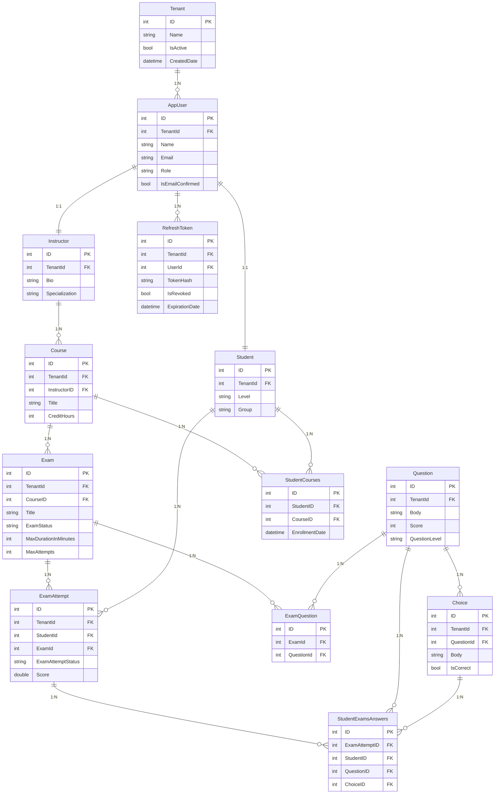
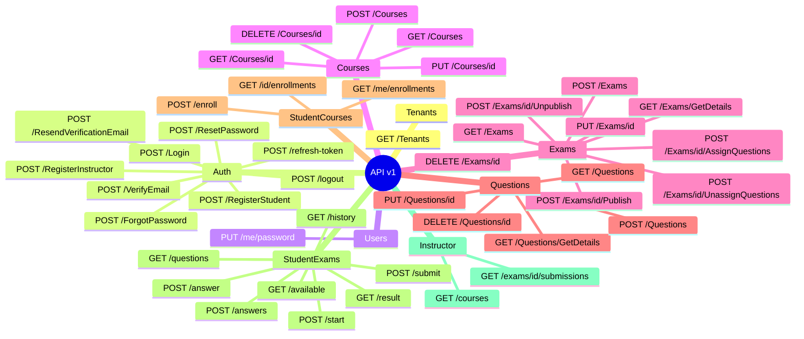

# 🎓 ExamSys — Examination System Web API

<div align="center">


**A production-ready, multi-tenant examination management API built on Clean Architecture**

[Features](#-features) • [Architecture](#-architecture) • [Getting Started](#-getting-started) • [API](#-api-documentation) • [Contributing](#-contributing)

</div>

---

## 📖 Overview

**ExamSys** is a comprehensive backend API for managing academic examinations across multiple institutions. Built with **.NET 8** and **Clean Architecture**, it supports the full exam lifecycle — from course enrollment and exam creation, through timed exam-taking with a scoped JWT, to automatic grading via background jobs.

### 🎯 Key Highlights

- 🏗️ **Clean Architecture** — Four-layer separation with strict dependency rules
- 🏢 **Multi-Tenancy** — Data isolation per institution via EF Core global query filters + tenant-aware Redis keys
- 🔐 **Dual-Token Auth** — JWT + Refresh Token with token blacklisting via Redis on logout
- ⏱️ **Timed Exams** — Exam-scoped JWT + Hangfire auto-close job when time expires
- ⚡ **Performance** — Redis caching, Brotli/Gzip response compression, paginated queries
- 🛡️ **Rate Limiting** — Sliding window limiter (100 req/min)
- 📊 **Observability** — Structured logging with Serilog → Seq

---

## ✨ Features [🔼](#table-of-contents)

### 🏢 Multi-Tenancy
- **Tenant Isolation** — Every entity scoped to a tenant; EF Core global query filters applied automatically
- **Tenant Lookup API** — Public endpoint for frontend registration/login dropdowns
- **Tenant-aware Cache** — Redis keys namespaced per tenant (`:tenant:{id}` postfix)

### 👤 User Management
- Role-based registration for Students and Instructors
- OTP-based email verification via Hangfire + MailKit
- Forgot password / reset password / change password
- Rotating refresh tokens with hash storage and revocation

### 📚 Course & Exam Management
- Full Course CRUD (Instructor-only create/update/delete)
- Student enrollment in courses
- Flexible exam configuration: duration, max attempts, shuffle, pass marks, exam types
- Question bank with Easy/Medium/Hard difficulty and multiple choices
- Exam lifecycle: Draft → Published → Archived

### 🎓 Exam Taking (Student Flow)
- Start exam → issues an exam-scoped JWT (time-limited, attempt-specific claims)
- Submit answers — single or batch
- Hangfire auto-closes the attempt when time expires (TimedOut status)
- Instant grading for small exams; async Hangfire job for large exams (> threshold)

### 📊 Dashboards
- **Student**: available exams, exam history, attempt results
- **Instructor**: course listings, exam submissions

---

## 🏗️ Architecture [🔼](#table-of-contents)

```
┌─────────────────────────────────────────────┐
│          ExaminationSystem.API              │  ← Presentation Layer
│    Controllers · Models · Validators        │
│    Middlewares · Extensions                 │
└─────────────────┬───────────────────────────┘
                  │
┌─────────────────▼───────────────────────────┐
│       ExaminationSystem.Application         │  ← Business Logic Layer
│    Services · DTOs · Interfaces             │
│    UseCases (Jobs) · Email Templates        │
└─────────────────┬───────────────────────────┘
                  │
┌─────────────────▼───────────────────────────┐
│      ExaminationSystem.Infrastructure       │  ← Data Access Layer
│   DbContext · Repositories · Migrations     │
│   JWT/Redis/Email/Hangfire implementations  │
└─────────────────┬───────────────────────────┘
                  │
┌─────────────────▼───────────────────────────┐
│         ExaminationSystem.Domain            │  ← Core Domain Layer
│      Entities · Enums · Interfaces          │
│          (zero external dependencies)       │
└─────────────────────────────────────────────┘
```

| Layer | Purpose | Dependencies |
|-------|---------|--------------|
| **Domain** | Core entities, enums, domain interfaces | None |
| **Application** | Business rules, services, DTOs, job use cases | Domain |
| **Infrastructure** | EF Core, Redis, JWT, email, Hangfire | Application + Domain |
| **API** | HTTP controllers, validators, request models | Application |

---

## 🛠️ Tech Stack [🔼](#table-of-contents)

| Technology | Version | Purpose |
|------------|---------|---------|
| .NET / ASP.NET Core | 8.0 | Web API framework |
| Entity Framework Core | 8.0 | ORM + code-first migrations |
| SQL Server | — | Primary database + Hangfire storage |
| Redis | — | Caching — OTPs, JTI blacklist, tenant-scoped keys |
| Hangfire | — | Background jobs (email, auto-close exam, grading) |
| FluentValidation | — | Declarative request validation |
| Mapster | — | High-performance object mapping |
| MailKit | — | Email with HTML templates |
| Serilog + Seq | — | Structured logging and aggregation |
| Asp.Versioning | — | API versioning (`/api/v1/`) |
| Swagger / OpenAPI | — | Interactive API docs with JWT auth |

---

## 🗄️ Database [🔼](#table-of-contents)



All entities (except `Tenant`) inherit from `BaseModel`: `ID`, `TenantId (FK → Tenant)`, `Deleted`, `CreatedBy`, `CreatedDate`, `UpdatedBy`, `UpdatedDate`.

| Entity | Description |
|--------|-------------|
| **Tenant** | Institution — standalone, no BaseModel |
| **AppUser** | Base user with role and auth data |
| **Instructor** | 1:1 with AppUser — instructor profile |
| **Student** | 1:1 with AppUser — student profile |
| **RefreshToken** | Hashed refresh tokens per user |
| **Course** | Academic course owned by an Instructor |
| **Exam** | Full exam config (duration, attempts, grading) |
| **Question** | Reusable question with difficulty level |
| **Choice** | Answer options per question |
| **ExamQuestion** | Join: Exam ↔ Question (N:M) |
| **StudentCourses** | Join: Student ↔ Course (N:M) |
| **ExamAttempt** | Student exam session with status and score |
| **StudentExamsAnswers** | Per-question answers within an attempt |

### Exam Attempt Lifecycle

```
NotStarted → InProgress → Completed ──┐
                         TimedOut  ──→── Grading → Graded
```

---

## 🚀 Getting Started [🔼](#table-of-contents)

### Prerequisites

| Tool | Version |
|------|---------|
| .NET SDK | 8.0+ |
| SQL Server | Any (LocalDB works for dev) |
| Redis | Any (optional for dev) |

### Installation

1. **Clone**
   ```bash
   git clone https://github.com/ahmads1990/ExaminationSystemWebAPI.git
   cd ExaminationSystemWebAPI
   ```

2. **Configure** — fill in `appsettings.json` (see [Configuration](#-configuration))

3. **Apply migrations**
   ```bash
   dotnet ef database update --project ExaminationSystem.Infrastructure --startup-project ExaminationSystem.API
   ```

4. **Run**
   ```bash
   dotnet run --project ExaminationSystem.API
   ```

5. Open **Swagger UI** at `https://localhost:PORT/swagger`  
   Open **Hangfire Dashboard** at `https://localhost:PORT/hangfire`

---

## 📚 API Documentation [🔼](#table-of-contents)

> 💡 Full interactive docs at `/swagger` when running locally.



**Auth Legend:** 🔓 Public · 🔐 JWT (any) · 👨‍🏫 Instructor · 🎓 Student · 🎫 ExamScope JWT

### Tenants
| Method | Route | Auth | Description |
|--------|-------|------|-------------|
| `GET` | `/api/v1/Tenants` | 🔓 | List active tenants (for registration dropdown) |

### Auth
| Method | Route | Auth | Description |
|--------|-------|------|-------------|
| `POST` | `/api/v1/Auth/RegisterInstructor` | 🔓 | Register instructor |
| `POST` | `/api/v1/Auth/RegisterStudent` | 🔓 | Register student |
| `POST` | `/api/v1/Auth/Login` | 🔓 | Login → `{ jwtToken, refreshToken }` |
| `POST` | `/api/v1/Auth/VerifyEmail` | 🔓 | Confirm email with OTP |
| `POST` | `/api/v1/Auth/ResendVerificationEmail` | 🔓 | Resend OTP |
| `POST` | `/api/v1/Auth/ForgotPassword` | 🔓 | Send password reset OTP |
| `POST` | `/api/v1/Auth/ResetPassword` | 🔓 | Reset password with OTP |
| `POST` | `/api/v1/Auth/refresh-token` | 🔓 | Rotate refresh token |
| `POST` | `/api/v1/Auth/logout` | 🔐 | Revoke tokens, blacklist JTI in Redis |

### Users
| Method | Route | Auth | Description |
|--------|-------|------|-------------|
| `PUT` | `/api/v1/Users/me/password` | 🔐 | Change own password |

### Courses
| Method | Route | Auth | Description |
|--------|-------|------|-------------|
| `GET` | `/api/v1/Courses` | 🔐 | List courses (paginated) |
| `GET` | `/api/v1/Courses/{id}` | 🔐 | Get course |
| `POST` | `/api/v1/Courses` | 👨‍🏫 | Create course |
| `PUT` | `/api/v1/Courses/{id}` | 👨‍🏫 | Update course |
| `DELETE` | `/api/v1/Courses/{id}` | 👨‍🏫 | Delete course |

### Exams
| Method | Route | Auth | Description |
|--------|-------|------|-------------|
| `GET` | `/api/v1/Exams` | 🔐 | List exams (paginated, filtered) |
| `GET` | `/api/v1/Exams/GetDetails` | 🔐 | Get exam with questions |
| `POST` | `/api/v1/Exams` | 👨‍🏫 | Create exam |
| `PUT` | `/api/v1/Exams/{id}` | 👨‍🏫 | Update exam |
| `DELETE` | `/api/v1/Exams/{id}` | 👨‍🏫 | Delete exam |
| `POST` | `/api/v1/Exams/{id}/Publish` | 👨‍🏫 | Publish exam |
| `POST` | `/api/v1/Exams/{id}/Unpublish` | 👨‍🏫 | Unpublish exam |
| `POST` | `/api/v1/Exams/{id}/AssignQuestions` | 👨‍🏫 | Assign questions |
| `POST` | `/api/v1/Exams/{id}/UnassignQuestions` | 👨‍🏫 | Remove questions |

### Questions
| Method | Route | Auth | Description |
|--------|-------|------|-------------|
| `GET` | `/api/v1/Questions` | 🔐 | List questions (paginated) |
| `GET` | `/api/v1/Questions/GetDetails` | 🔐 | Get question with choices |
| `POST` | `/api/v1/Questions` | 👨‍🏫 | Create question |
| `PUT` | `/api/v1/Questions/{id}` | 👨‍🏫 | Update question |
| `DELETE` | `/api/v1/Questions/{id}` | 👨‍🏫 | Delete question |

### Student Courses
| Method | Route | Auth | Description |
|--------|-------|------|-------------|
| `GET` | `/api/v1/StudentCourses/me/enrollments` | 🎓 | My enrollments |
| `GET` | `/api/v1/StudentCourses/{id}/enrollments` | 👨‍🏫 | Student enrollments |
| `POST` | `/api/v1/StudentCourses/enroll` | 🎓 | Enroll in course |

### Student Exams
| Method | Route | Auth | Description |
|--------|-------|------|-------------|
| `GET` | `/api/v1/StudentExams/available` | 🎓 | List available exams |
| `GET` | `/api/v1/StudentExams/history` | 🎓 | Attempt history |
| `POST` | `/api/v1/StudentExams/start` | 🎓 | Start exam → exam-scoped JWT |
| `GET` | `/api/v1/StudentExams/questions` | 🎫 | Get exam questions |
| `POST` | `/api/v1/StudentExams/answer` | 🎫 | Submit single answer |
| `POST` | `/api/v1/StudentExams/answers` | 🎫 | Submit all answers (batch) |
| `POST` | `/api/v1/StudentExams/submit` | 🎫 | Submit attempt |
| `GET` | `/api/v1/StudentExams/result` | 🎓 | Get attempt result |

### Instructor
| Method | Route | Auth | Description |
|--------|-------|------|-------------|
| `GET` | `/api/v1/Instructor/courses` | 👨‍🏫 | My courses |
| `GET` | `/api/v1/Instructor/exams/{examId}/submissions` | 👨‍🏫 | Exam submissions |

---

## 🔐 Authentication Flow [🔼](#table-of-contents)

```
1. GET  /api/v1/Tenants           → pick your institution (tenantId)
2. POST /api/v1/Auth/Register     → register with tenantId
3. POST /api/v1/Auth/VerifyEmail  → confirm with OTP from inbox
4. POST /api/v1/Auth/Login        → receive { jwtToken, refreshToken }
5.      Authorization: Bearer <jwtToken>  on all protected requests
6. POST /api/v1/StudentExams/start→ receive exam-scoped JWT (timed)
7.      Use exam JWT for /questions /answer /submit
8. POST /api/v1/Auth/refresh-token→ rotate JWT when it expires
9. POST /api/v1/Auth/logout       → JTI blacklisted in Redis
```

---

## ⚙️ Configuration [🔼](#table-of-contents)

```json
{
  "ConnectionStrings": {
    "DefaultConnection": "Server=.;Database=ExaminationSystemDB;Trusted_Connection=True;TrustServerCertificate=True"
  },
  "Jwt": {
    "Key": "your-secret-key-minimum-32-characters-long",
    "Issuer": "ExaminationSystemAPI",
    "Audience": "ExaminationSystemClients",
    "DurationInHours": 24,
    "RefreshTokenLifeInDays": 7
  },
  "SMTPConfig": {
    "Host": "smtp.gmail.com",
    "Port": 587,
    "Username": "your-email@gmail.com",
    "Password": "your-app-password",
    "FromEmail": "noreply@examsystem.com",
    "FromName": "Examination System"
  },
  "RedisConfig": {
    "Host": "localhost",
    "Port": 6379,
    "InstanceName": "ExamSystem_"
  },
  "BackendBaseUrl": "https://localhost:PORT",
  "Seq": { "ServerUrl": "http://localhost:5341" }
}
```

---

## 📁 Project Structure [🔼](#table-of-contents)

```
ExaminationSystemWebAPI/
├── ExaminationSystem.API/
│   ├── Controllers/           # 9 controllers
│   ├── Models/Requests/       # Typed request models
│   ├── Validators/            # FluentValidation
│   ├── Middlewares/           # Token blacklist, transactions, errors
│   └── Program.cs
│
├── ExaminationSystem.Application/
│   ├── Services/              # 11 service implementations
│   ├── Interfaces/            # Service + job contracts
│   ├── InfraInterfaces/       # ICachingService, IEmailService…
│   ├── DTOs/                  # Per-feature DTOs
│   ├── UseCases/              # Hangfire job classes
│   └── EmailTemplates/        # HTML templates
│
├── ExaminationSystem.Infrastructure/
│   ├── Data/
│   │   ├── AppDbContext.cs    # EF context + global query filters
│   │   ├── Repositories/      # Generic repository
│   │   └── Seeding/           # Dev seed data (2 tenants)
│   └── Services/
│       ├── Auth/              # JWT + password helpers
│       ├── Cache/             # Tenant-aware Redis service
│       └── Email/             # MailKit service
│
├── ExaminationSystem.Domain/
│   ├── Entities/              # 13 entities + BaseModel
│   ├── Interfaces/            # IRepository<T>
│   └── Common/                # Enums, constants
│
├── ExaminationSystem.UnitTests/   # 143 unit tests
└── agent/                         # Dev resources & docs
```

---

## 🧪 Testing [🔼](#table-of-contents)

```bash
dotnet test
```

**143 tests** across `AuthService`, `UserService`, `InstructorService`, `StudentService`, `CourseService`, `ExamService`, `QuestionService`, and `StudentExamService`.

---

## 🤝 Contributing [🔼](#table-of-contents)

1. Fork the repo and create a feature branch: `git checkout -b feature/your-feature`
2. Commit: `git commit -m "feat: your description"`
3. Push and open a Pull Request

Open an [Issue](https://github.com/ahmads1990/ExaminationSystemWebAPI/issues) to discuss significant changes first.

## 👨‍💻 Author

**Ahmad**  
[](https://github.com/ahmads1990)

---

<div align="center">

**⭐ Star this repository if you find it helpful!**

Made with ❤️ using .NET 8

</div>